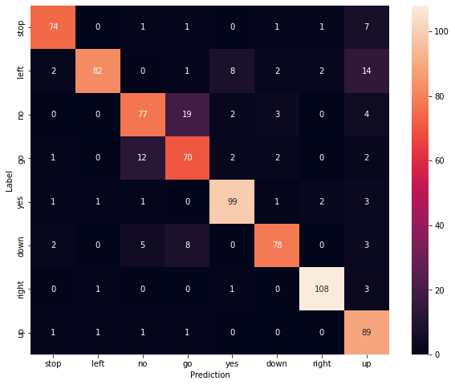
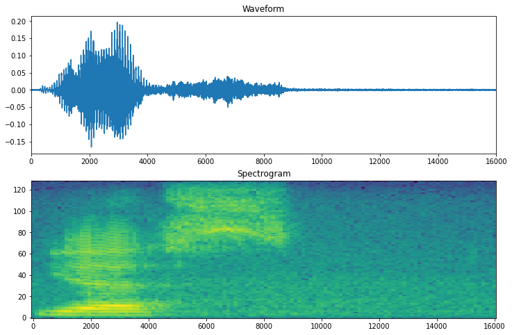
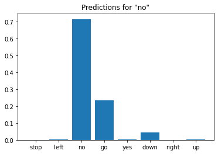

# Keyword-detection
Created a keyword detector using CNNs on Mel Spectrograms, this acts as a precursor to speech recognition
The original dataset consists of over 105,000 audio files in the WAV (Waveform) audio file format of people saying 35 different words. This data was collected by Google and released under a CC BY license.

Display a confusion matrix
Use a confusion matrix to check how well the model did classifying each of the commands in the test set

Run inference on an audio file:
Convert waveforms to spectrograms
The waveforms in the dataset are represented in the time domain.  transform the waveforms from the time-domain signals into the time-frequency-domain signals by computing the short-time Fourier transform (STFT) to convert the waveforms to as spectrograms, which show frequency changes over time and can be represented as 2D images.

#wave and specogram form of input audio

#spectogram of input audio

