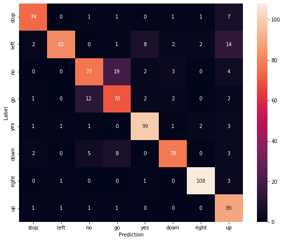
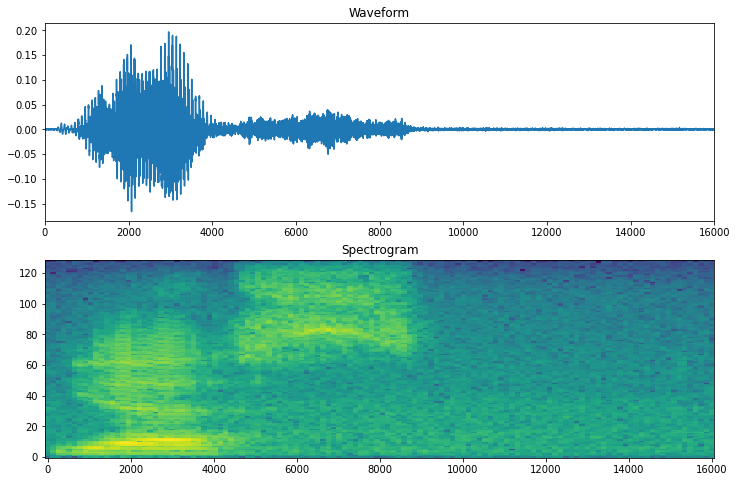
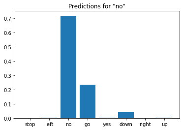

# Keyword-detection
Created a keyword detector using CNNs on Mel Spectrograms, this acts as a precursor to speech recognition
The original dataset consists of over 105,000 audio files in the WAV (Waveform) audio file format of people saying 35 different words. This data was collected by Google and released under a CC BY license.

#### Setup
Imported necessary modules and dependencies. i'll be using seaborn for visualization

#### Impored the mini Speech Commands dataset
The  dataset consists of over 105,000 audio files in the WAV (Waveform) audio file format of people saying 35 different words. This data was collected by Google and released under a CC BY license.
The dataset's audio clips are stored in eight folders corresponding to each speech command: no, yes, down, go, left, up, right, and stop:

then Extracted the audio clips into a list called filenames, and shuffle it:

then Splited filenames into training, validation and test sets using a 80:10:10 ratio, respectively:

#### Read the audio files and their labels
**In this section i  preprocessed the dataset, creating decoded tensors for the waveforms and the corresponding labels.**
Each WAV file contains time-series data with a set number of samples per second.
Each sample represents the amplitude of the audio signal at that specific time.
In a 16-bit system, like the WAV files in the mini Speech Commands dataset, the amplitude values range from -32,768 to 32,767.
The sample rate for this dataset is 16kHz.

#### Build the training set to extract the audio-label pairs:
Create a tf.data.Dataset with Dataset.from_tensor_slices and Dataset.map, using get_waveform_and_label defined earlier.

#### few audio waveforms of data set:

Display a confusion matrix
Use a confusion matrix to check how well the model did classifying each of the commands in the test set

Run inference on an audio file:
Convert waveforms to spectrograms
The waveforms in the dataset are represented in the time domain.  transform the waveforms from the time-domain signals into the time-frequency-domain signals by computing the short-time Fourier transform (STFT) to convert the waveforms to as spectrograms, which show frequency changes over time and can be represented as 2D images.

#wave and specogram form of input audio

#spectogram of input audio

