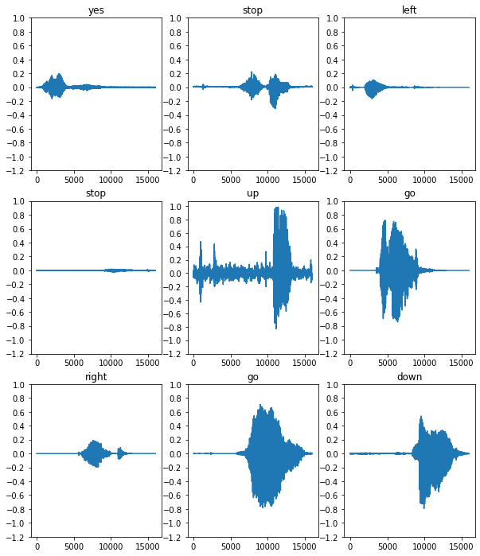

# Keyword-detection
Created a keyword detector using CNNs on Mel Spectrograms, this acts as a precursor to speech recognition
The original dataset consists of over 105,000 audio files in the WAV (Waveform) audio file format of people saying 35 different words. This data was collected by Google and released under a CC BY license.

### Setup
Imported necessary modules and dependencies. i'll be using seaborn for visualization

### Impored the mini Speech Commands dataset
The  dataset consists of over 105,000 audio files in the WAV (Waveform) audio file format of people saying 35 different words. This data was collected by Google and released under a CC BY license.
The dataset's audio clips are stored in eight folders corresponding to each speech command: no, yes, down, go, left, up, right, and stop:

then Extracted the audio clips into a list called filenames, and shuffle it:

then Splited filenames into training, validation and test sets using a 80:10:10 ratio, respectively:

### Read the audio files and their labels
**In this section i  preprocessed the dataset, creating decoded tensors for the waveforms and the corresponding labels.**
Each WAV file contains time-series data with a set number of samples per second.
Each sample represents the amplitude of the audio signal at that specific time.
In a 16-bit system, like the WAV files in the mini Speech Commands dataset, the amplitude values range from -32,768 to 32,767.
The sample rate for this dataset is 16kHz.

### Build the training set to extract the audio-label pairs:
Create a tf.data.Dataset with Dataset.from_tensor_slices and Dataset.map, using get_waveform_and_label defined earlier.

### few audio waveforms of data set:

### Convert waveforms to spectrograms
The waveforms in the dataset are represented in the time domain. so, i'll transform the waveforms from the time-domain signals into the time-frequency-domain signals by computing the short-time Fourier transform (STFT) to convert the waveforms to as spectrograms, which show frequency changes over time and can be represented as 2D images. i will feed the spectrogram images into your neural network to train the model

A Fourier transform (tf.signal.fft) converts a signal to its component frequencies, but loses all time information. In comparison, STFT (tf.signal.stft) splits the signal into windows of time and runs a Fourier transform on each window, preserving some time information, and returning a 2D tensor that you can run standard convolutions on.

Created a utility function for converting waveforms to spectrograms:
The waveforms need to be of the same length, so that when you convert them to spectrograms, the results have similar dimensions. This can be done by simply zero-padding the audio clips that are shorter than one second (using tf.zeros).

When calling tf.signal.stft, choose the frame_length and frame_step parameters such that the generated spectrogram "image" is almost square.

### define a function that transforms the waveform dataset into spectrograms and their corresponding labels as integer IDs

def get_spectrogram_and_label_id(audio, label):
  spectrogram = get_spectrogram(audio)
  label_id = tf.argmax(label == commands)
  return spectrogram, label_id
  
### Examine the spectrograms for different examples of the dataset:

### Build and train the model
Repeated the training set preprocessing on the validation and test sets:

Batch the training and validation sets for model training:
batch_size = 64
train_ds = train_ds.batch(batch_size)
val_ds = val_ds.batch(batch_size)

Added Dataset.cache and Dataset.prefetch operations to reduce read latency while training the model:
train_ds = train_ds.cache().prefetch(AUTOTUNE)
val_ds = val_ds.cache().prefetch(AUTOTUNE)

For the model, i'll use a simple convolutional neural network (CNN), since i have transformed the audio files into spectrogram images.

tf.keras.Sequential model will use the following Keras preprocessing layers:
tf.keras.layers.Resizing: to downsample the input to enable the model to train faster.
tf.keras.layers.Normalization: to normalize each pixel in the image based on its mean and standard deviation.
For the Normalization layer, its adapt method would first need to be called on the training data in order to compute aggregate statistics (that is, the mean and the standard deviation).

Input shape: (124, 129, 1)
Model: "sequential"

**Configureed the Keras model with the Adam optimizer and the cross-entropy loss:**

model.compile(
    optimizer=tf.keras.optimizers.Adam(),
    loss=tf.keras.losses.SparseCategoricalCrossentropy(from_logits=True),
    metrics=['accuracy'],
)

**Trained the model over 10 epochs for demonstration purposes:**
EPOCHS = 10
history = model.fit(
    train_ds,
    validation_data=val_ds,
    epochs=EPOCHS,
    callbacks=tf.keras.callbacks.EarlyStopping(verbose=1, patience=2),
)

Epoch 1/10
100/100 [==============================] - 6s 41ms/step - loss: 1.7503 - accuracy: 0.3630 - val_loss: 1.2850 - val_accuracy: 0.5763
Epoch 2/10
100/100 [==============================] - 0s 5ms/step - loss: 1.2101 - accuracy: 0.5698 - val_loss: 0.9314 - val_accuracy: 0.6913
Epoch 3/10
100/100 [==============================] - 0s 5ms/step - loss: 0.9336 - accuracy: 0.6703 - val_loss: 0.7529 - val_accuracy: 0.7325
Epoch 4/10
100/100 [==============================] - 0s 5ms/step - loss: 0.7503 - accuracy: 0.7397 - val_loss: 0.6721 - val_accuracy: 0.7713
Epoch 5/10
100/100 [==============================] - 0s 5ms/step - loss: 0.6367 - accuracy: 0.7741 - val_loss: 0.6061 - val_accuracy: 0.7975
Epoch 6/10
100/100 [==============================] - 0s 5ms/step - loss: 0.5650 - accuracy: 0.7987 - val_loss: 0.5489 - val_accuracy: 0.8125
Epoch 7/10
100/100 [==============================] - 0s 5ms/step - loss: 0.5099 - accuracy: 0.8183 - val_loss: 0.5344 - val_accuracy: 0.8238
Epoch 8/10
100/100 [==============================] - 0s 5ms/step - loss: 0.4560 - accuracy: 0.8392 - val_loss: 0.5194 - val_accuracy: 0.8288
Epoch 9/10
100/100 [==============================] - 0s 5ms/step - loss: 0.4101 - accuracy: 0.8547 - val_loss: 0.4809 - val_accuracy: 0.8388
Epoch 10/10
100/100 [==============================] - 0s 5ms/step - loss: 0.3905 - accuracy: 0.8589 - val_loss: 0.4973 - val_accuracy: 0.8363

**training and validation loss curves to check how my model has improved during training:**

###  Evaluate the model performance
**then i Run the model on the test set and check the model's performance:**

test_audio = []
test_labels = []

for audio, label in test_ds:
  test_audio.append(audio.numpy())
  test_labels.append(label.numpy())

test_audio = np.array(test_audio)
test_labels = np.array(test_labels)

y_pred = np.argmax(model.predict(test_audio), axis=1)
y_true = test_labels

test_acc = sum(y_pred == y_true) / len(y_true)
print(f'Test set accuracy: {test_acc:.0%}')

Test set accuracy: 85%

Display a confusion matrix
Use a confusion matrix to check how well the model did classifying each of the commands in the test set

Run inference on an audio file:
Convert waveforms to spectrograms
The waveforms in the dataset are represented in the time domain.  transform the waveforms from the time-domain signals into the time-frequency-domain signals by computing the short-time Fourier transform (STFT) to convert the waveforms to as spectrograms, which show frequency changes over time and can be represented as 2D images.

#wave and specogram form of input audio

#spectogram of input audio

